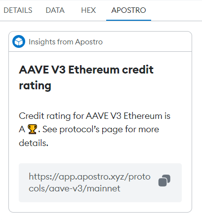

<h1 style='text-align: center'>Apostro Snap</h1>
<div style='text-align: center'></div>

<p style='text-align: center; margin: 20px auto;'>
<a href='https://www.apostro.xyz/' target='_blank' rel='noopener noreferrer'>Website</a>
•
<a href='https://explorer.apostro.xyz/' target='_blank' rel='noopener noreferrer'>App</a>
•
<a href='https://docs.apostro.xyz/' target='_blank' rel='noopener noreferrer'>Docs</a>
•
<a href='https://twitter.com/apostroxyz' target='_blank' rel='noopener noreferrer'>Twitter</a>
</p>

Apostro offers a straightforward way to check the credit ratings of lending protocols, helping you make informed investment decisions. It's a practical tool for anyone looking to understand and manage portfolio risks with ease. Whether you're a beginner or an experienced investor, Apostro guides you in identifying potential risks, ensuring smarter and safer investments.

<div style='text-align: center'></div>

This repository contains Apostro Snap code and a frontend that connects to Snap.

MetaMask Snaps is a system that allows anyone to safely expand the capabilities of MetaMask. A snap is a program that we run in an isolated environment that can customize the wallet experience. For more details, see [the MetaMask documentation](https://docs.metamask.io/snaps/).

## Development

### Prerequisites

- ⚠️ **Snaps is pre-release software**. To interact with Snaps, you will need to install [MetaMask Flask](https://metamask.io/flask/).
- [Node.js](https://nodejs.org/en) 18.16.\* or later
- [Yarn](https://yarnpkg.com/) version 3

Set up the development environment:

```shell
yarn install && yarn start
```

Snap server: http://localhost:8081/
UI: http://localhost:3000/

#### Connection to @apostroxyz/metamask-snap

If you want to connect the frontend to the npm package `@apostroxyz/metamask-snap`, you should uncomment `SNAP_ORIGIN` variable in the `./packages/site/.env.development` file

#### Linting

Run `yarn lint` to run the linter, or run `yarn lint:fix` to run the linter and
fix any automatically fixable issues.

### Notes

- Scripts are disabled by default for security reasons. If you need to use NPM
  packages with scripts, you can run `yarn allow-scripts auto`, and enable the
  script in the `lavamoat.allowScripts` section of `package.json`.
  See the documentation for [@lavamoat/allow-scripts](https://github.com/LavaMoat/LavaMoat/tree/main/packages/allow-scripts) for more information.
